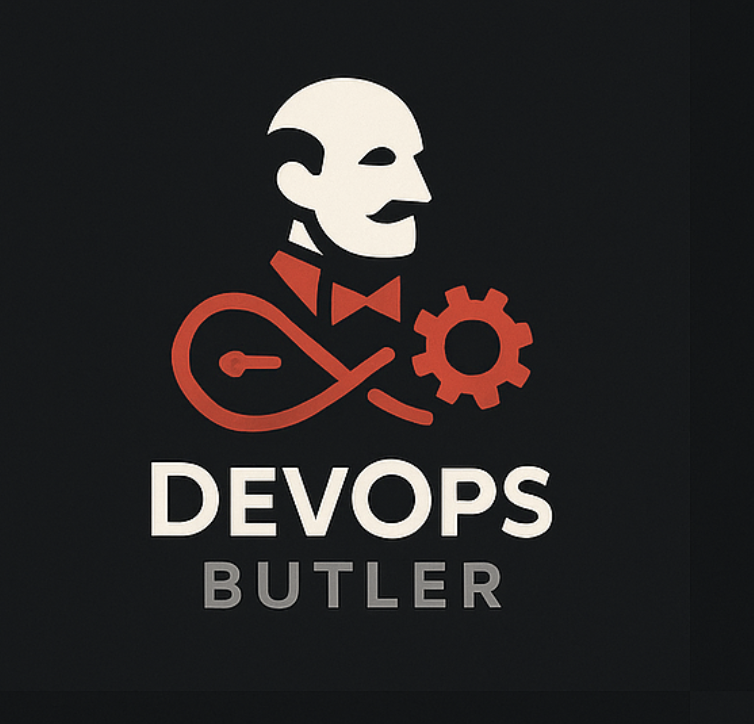

# 🤵‍♂️ DevOps Butler

Your personal, local deployment assistant. DevOps Butler is a Python-based platform that runs on your local machine, designed to completely automate the process of deploying a project from a Git repository to a live, accessible URL.

Give the Butler a Git URL, and it will handle the rest—from cloning and analysis to building, running, and networking—all while providing real-time logs of its every move.




## ✨ Core Features

*   **🚀 One-Click Deployments:** Start an entire deployment with a single click from the beautiful web interface or a `POST` request.
*   **🧠 Intelligent Analysis:** Automatically detects project structure and chooses the optimal deployment strategy:
    - Simple docker-compose files → Docker Compose deployment
    - Complex multi-service setups → Dockerfile deployment
    - No Dockerfile → AI-generated Dockerfile
*   **📊 Deployment History:** Track all deployments with status, URLs, and timestamps in a persistent database.
*   **🗑️ Lifecycle Management:** Complete destroy functionality to clean up deployments and prevent resource conflicts.
*   **🧹 Automated Cleanup:** Automatically removes orphaned Nginx configs and prevents restart loops.
*   **🔍 Enhanced Error Handling:** Detailed error messages and validation for better debugging.
*   **🌐 Beautiful Web UI:** Modern, responsive interface with real-time deployment status and logs.
*   **📡 Real-time Logging:** Uses WebSockets to stream live, color-coded logs directly to you as the pipeline runs.
*   **🔄 Automatic Reverse Proxy:** Integrates with Nginx to automatically configure a reverse proxy for each deployed application.
*   **🎯 Pretty Local URLs:** Makes your deployed applications accessible via clean, predictable URLs like `http://project-name.localhost:8888`.
*   **⚡ Idempotent Deployments:** Automatically cleans up previous deployments before creating new ones.

## 🛠️ Tech Stack

*   **Backend Framework:** [FastAPI](https://fastapi.tiangolo.com/)
*   **Frontend:** HTML5, CSS3, JavaScript (Vanilla)
*   **Real-time Communication:** WebSockets
*   **Database:** SQLite with SQLModel ORM
*   **Orchestration Engine:** Python (`subprocess`, `asyncio`)
*   **Containerization:** Docker & Docker Compose
*   **Reverse Proxy:** Nginx
*   **AI Integration:** OpenAI API for Dockerfile generation
*   **Primary Dependencies:** `uvicorn`, `pydantic`, `sqlmodel`

## ⚙️ How It Works

The DevOps Butler operates as an event-driven system with a clear, modular architecture.

### **Deployment Pipeline:**

1.  **🎯 URL Validation:** Validates the Git URL and rejects invalid URLs (Docker Hub, container registries, etc.)
2.  **🧹 Automated Cleanup:** Removes orphaned Nginx configs and cleans up previous deployments
3.  **📋 Database Record:** Creates a deployment record with "starting" status
4.  **📥 Repository Clone:** Clones the Git repository into a temporary local directory
5.  **🔍 Intelligent Analysis:** 
    - Checks for docker-compose.yml and Dockerfile
    - Analyzes complexity (dependencies, multiple services)
    - Chooses optimal deployment strategy
6.  **🏗️ Build & Deploy:**
    - **Docker Compose:** For simple single-service setups
    - **Dockerfile:** For complex multi-service or single-container apps
    - **AI Generation:** Creates Dockerfile if none exists
7.  **🔧 Port Discovery:** Automatically discovers exposed ports from Dockerfiles or container inspection
8.  **🌐 Nginx Configuration:** Creates reverse proxy config with container networking
9.  **✅ Success:** Updates database and broadcasts final URL

### **Lifecycle Management:**

- **🔄 Idempotent Deployments:** Same repo can be deployed multiple times safely
- **🗑️ Destroy Functionality:** Complete cleanup of containers, configs, and database records
- **🧹 Orphaned Config Cleanup:** Prevents Nginx restart loops from stale configs

## 🚀 Getting Started

### Prerequisites

You must have the following tools installed on your macOS machine:

1.  **Homebrew:** The missing package manager for macOS.
2.  **Python 3.11+**
3.  **Docker Desktop:** Make sure the Docker engine is running.

### Installation & Setup

1.  **Clone the Repository**
    ```bash
    git clone https://github.com/your-username/DevOps-Butler.git
    cd DevOps-Butler
    ```

2.  **Create a Python Virtual Environment**
    ```bash
    python3 -m venv venv
    source venv/bin/activate
    ```

3.  **Install Dependencies**
    ```bash
    pip install -r requirements.txt
    ```

4.  **Set Up Docker Network**
    ```bash
    # Create the custom network for container communication
    docker network create devops-butler-net
    ```

5.  **Start Nginx Proxy Container**
    ```bash
    # Run the Nginx proxy container with volume mounts
    docker run -d \
      --name butler-nginx-proxy \
      --network devops-butler-net \
      -p 8888:8888 \
      -v /opt/homebrew/etc/nginx/servers:/etc/nginx/conf.d \
      nginx:latest
    ```

6.  **Install and Configure Nginx (Local)**
    ```bash
    # Install Nginx
    brew install nginx

    # Create the directory for our site configs
    sudo mkdir -p /opt/homebrew/etc/nginx/servers
    sudo chown $(whoami) /opt/homebrew/etc/nginx/servers
    ```

### Usage

#### **Web Interface (Recommended)**

1.  **Start the DevOps Butler Server**
    ```bash
    # Make sure your venv is active
    python orchestrator.py
    ```

2.  **Open the Web Interface**
    Navigate to `http://localhost:8000` in your browser

3.  **Deploy Your First App**
    - Paste a Git repository URL
    - Click the "🚀 Deploy" button
    - Watch real-time logs and deployment progress
    - Access your app at the provided URL

#### **API Usage**

1.  **Start the Server**
    ```bash
    uvicorn orchestrator:app --reload
    ```

2.  **Deploy an Application**
    ```bash
    curl -X POST "http://127.0.0.1:8000/deploy" \
    -H "Content-Type: application/json" \
    -d '{"git_url": "https://github.com/some-user/some-repo.git"}'
    ```

3.  **View Deployment History**
    ```bash
    curl -X GET "http://127.0.0.1:8000/deployments"
    ```

4.  **Destroy a Deployment**
    ```bash
    curl -X DELETE "http://127.0.0.1:8000/deployments/container-name"
    ```

5.  **Clean Up Orphaned Configs**
    ```bash
    curl -X POST "http://127.0.0.1:8000/cleanup/orphaned-configs"
    ```

## 🎯 Supported Repository Types

### **Dockerfile Projects**
- Single container applications
- Multi-stage builds
- Custom base images
- Port exposure via `EXPOSE` directive

### **Docker Compose Projects**
- Simple single-service setups
- Automatic service discovery
- Port mapping detection
- **Note:** Complex multi-service setups with dependencies are handled via Dockerfile approach

### **No Dockerfile Projects**
- AI-generated Dockerfiles
- Automatic dependency detection
- Smart port inference
- Language-specific optimizations

## 🔧 API Endpoints

| Method | Endpoint | Description |
|--------|----------|-------------|
| `GET` | `/` | Web interface |
| `POST` | `/deploy` | Deploy a Git repository |
| `GET` | `/deployments` | List all deployments |
| `DELETE` | `/deployments/{container_name}` | Destroy a deployment |
| `DELETE` | `/deployments/clear` | Clear all deployment history |
| `POST` | `/cleanup/orphaned-configs` | Clean up orphaned Nginx configs |
| `GET` | `/ws/{client_id}` | WebSocket for real-time logs |

## 🛡️ Error Handling & Validation

- **URL Validation:** Rejects invalid URLs (Docker Hub, container registries)
- **Build Error Reporting:** Detailed Docker build error messages
- **Network Validation:** Ensures containers are accessible before Nginx configuration
- **Graceful Failures:** Proper cleanup on deployment failures
- **Orphaned Config Prevention:** Automatic cleanup of stale Nginx configurations

## 🔮 Future Roadmap

*   [x] **Build a Proper Frontend:** ✅ Beautiful web interface with real-time updates
*   [x] **Persistence:** ✅ SQLite database with deployment history
*   [x] **Cleanup Logic:** ✅ Complete destroy functionality
*   [x] **Enhanced Log Streaming:** ✅ Real-time WebSocket logs
*   [ ] **Multi-Environment Support:** Support for staging, production environments
*   [ ] **Health Checks:** Automatic health monitoring of deployed applications
*   [ ] **Resource Monitoring:** CPU, memory, and disk usage tracking
*   [ ] **Custom Domains:** Support for custom domain names
*   [ ] **SSL/TLS Support:** Automatic HTTPS certificate generation
*   [ ] **PaaS Transformation:** Cloud deployment with AWS/GCP/Azure

## 🤝 Contributing

1. Fork the repository
2. Create a feature branch (`git checkout -b feature/amazing-feature`)
3. Commit your changes (`git commit -m 'Add amazing feature'`)
4. Push to the branch (`git push origin feature/amazing-feature`)
5. Open a Pull Request

## 🙏 Acknowledgments

- FastAPI for the excellent web framework
- Docker for containerization technology
- Nginx for reverse proxy capabilities
- The open-source community for inspiration and tools

